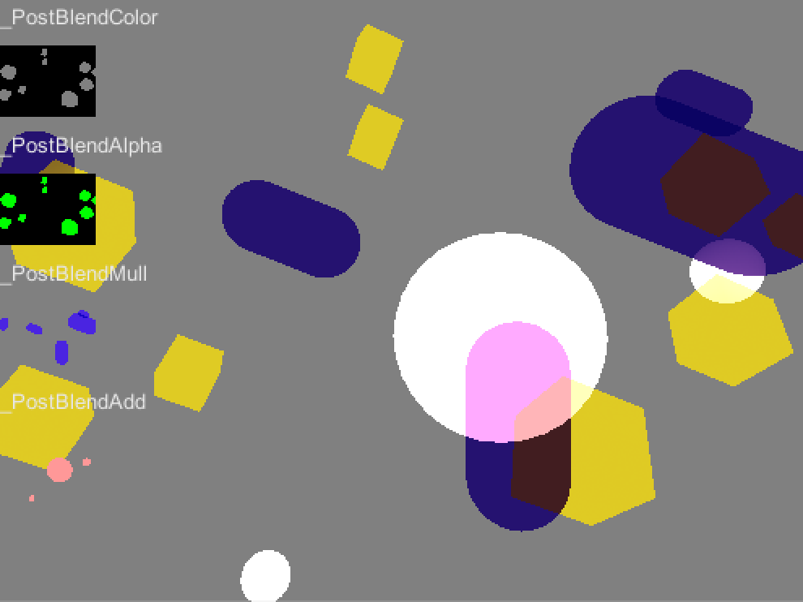

# CustomMRT-Blending-Example
半透明を綺麗にブレンディングする、試行錯誤。

普通にアルファブレンドするだけだと、後ろの方のメッシュが前に書かれたり。とか、しちゃう問題を解決！

- [OIT](https://shikihuiku.wordpress.com/2013/12/20/weighted-blended-order-independent-transparencyについて/)
- Multi Render Targetで、Color/Alpha/Additive/Multiplyの各要素を別々でRenderTextureに出力。
- 各要素の[w]に、Depthの情報を格納し、合成の時に、前のものは前に来るように、してる！
